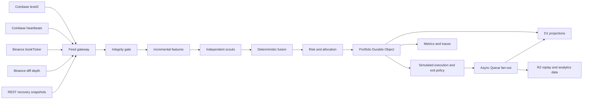

# Target Architecture

## 1. Purpose

Build a low-latency, data-correct, simulation-first execution path that preserves the existing safety boundary while improving event freshness, state consistency, duplicate protection, staged exits, and observability.

The target must remain deterministic, replayable, and independently testable. General-purpose AI agents may support research and operations, but they do not make latency-critical execution decisions.

## 2. Required topology

## 3. Critical path

The synchronous path is:

1. receive a normalized exchange event;
2. verify sequence continuity, heartbeat state, and event age;
3. update features incrementally;
4. run bounded independent scouts;
5. combine outputs deterministically;
6. run the authoritative risk decision;
7. send one versioned intent to the portfolio Durable Object;
8. reject duplicates and mutate the simulation ledger atomically;
9. return the committed result.

Queues, D1 projections, alerts, training data, reporting, and audit fan-out are not permitted between steps 1 and 8.

## 4. Market data policy

### Primary

- Coinbase Advanced Trade `level2` for synchronized book state.
- Coinbase `heartbeats` for connection liveness and missed-message detection.

### Secondary

- Binance `bookTicker` for top-of-book confirmation.
- Binance diff-depth for secondary depth and integrity comparison.

### REST

REST is limited to:

- initial snapshot bootstrap;
- controlled recovery after a detected sequence gap;
- historical research and slow-path analytics.

REST, D1 cache, and static fallback values are never executable entry prices.

## 5. Integrity state machine

Each symbol/source pair must expose:

- `connection_state`;
- `last_heartbeat_at`;
- `last_event_at`;
- `exchange_event_at`;
- `event_age_ms`;
- `sequence_state`;
- `last_sequence`;
- `gap_count`;
- `recovery_state`;
- `recovery_started_at`;
- `recovery_completed_at`.

Allowed states:

- `healthy` — entry and exit evaluation allowed;
- `degraded` — no new entry; protective reduction only with healthy secondary confirmation;
- `resyncing` — no new entry and no ordinary profit-taking action;
- `unavailable` — display only.

Static or cached prices must always map to `unavailable` for execution purposes.

## 6. Freshness classes

Initial values for liquid majors:

- `green`: event age at or below 500 ms and integrity healthy;
- `amber`: above 500 ms and at or below 1500 ms; protective reduction only when independently confirmed;
- `red`: above 1500 ms or integrity unhealthy; non-executable.

These are starting values, not permanent constants. Move them to versioned configuration after replay evidence exists.

## 7. Scout and fusion rules

Scouts are narrow and independent:

- momentum;
- order-book imbalance;
- liquidity and spread;
- short-horizon reversal;
- realized volatility;
- feed disagreement.

Scouts return observations, not orders. Each output includes:

- symbol;
- event identifier;
- score;
- confidence;
- feature version;
- model or rule version;
- source age;
- reasons.

Fusion must be deterministic and bounded. It must produce a candidate action plus a complete reason record. It cannot allocate capital.

## 8. Risk authority

The risk engine is the only component allowed to approve size. It evaluates:

- available reusable cash;
- protected reserve;
- per-symbol and total exposure;
- drawdown;
- guardian state;
- source age and integrity;
- volatility;
- spread and liquidity;
- cooldown and churn state;
- existing position state;
- execution policy.

The risk decision is immutable input to the portfolio state owner.

## 9. Portfolio Durable Object

Use one Durable Object per portfolio or user portfolio. Do not use one global singleton.

The Durable Object is the only writer for:

- reusable cash;
- reserved cash;
- protected reserve;
- open positions;
- fills;
- realized and unrealized accounting state;
- peak equity and drawdown;
- cooldown state;
- exit-policy state;
- intent idempotency.

The transaction must:

1. reject an existing idempotency key;
2. verify guardian and action constraints;
3. verify price integrity and freshness class;
4. reserve cash or inventory;
5. insert the intent;
6. apply entry, partial reduction, or close;
7. calculate fees and modeled slippage;
8. calculate realized result;
9. apply protected-reserve transfer if configured;
10. persist the final portfolio state;
11. write an outbox event for asynchronous projection.

A partial transaction is a failure. No external Queue or D1 write may be required for the transaction to commit.

## 10. Exit policy

Default simulation exit policy:

- take an initial reduction with an aggressive simulated fill when net edge is decaying and expected value remains positive after spread, fees, and slippage;
- keep the remainder under a volatility-scaled trailing floor;
- allow passive repost simulation only when liquidity and persistence rules permit it;
- apply cooldown after exit or stop-out;
- transfer a configurable share of positive realized result to protected reserve.

The reserve is not reusable by ordinary allocation logic. Releasing it requires a separate explicit policy and audit event.

## 11. Projection model

D1 stores read-optimized projections and historical records:

- intent history;
- fill history;
- position snapshots;
- portfolio summaries;
- reserve transfers;
- feed-health history;
- latency spans;
- rejection reasons;
- audit records.

The frontend reads D1-backed APIs. It does not directly depend on Durable Object internal storage.

Use an outbox identifier so projection consumers remain idempotent under at-least-once Queue delivery.

## 12. Observability

Required metrics:

- `decision_latency_ms`;
- `decision_data_age_ms`;
- `sequence_gap_recovery_ms`;
- `duplicate_reject_rate`;
- `stale_reject_rate`;
- `profit_capture_ratio`;
- `post_entry_adverse_move`;
- `post_exit_regret`;
- `churn_rate`;
- `ledger_atomicity_failures`;
- `queue_projection_lag_ms`.

Every decision trace must contain:

- trace id;
- source event id;
- symbol;
- feed source;
- exchange timestamp;
- receive timestamp;
- freshness class;
- sequence and heartbeat state;
- scout versions;
- fusion version;
- risk-policy version;
- intent idempotency key;
- portfolio id;
- final decision and rejection reason.

## 13. Performance budgets

Initial internal targets after a valid event reaches the Worker:

- normalize and integrity gate: 1–5 ms;
- incremental features and scouts: 1–5 ms;
- fusion and risk: 1–5 ms;
- Durable Object transaction: 5–20 ms;
- p95 end-to-end internal decision: below 50 ms.

These are engineering targets, not platform guarantees. A build cannot claim success using internal latency alone; event age must also be reported.

## 14. Safety invariants

- `TRADING_MODE=paper`.
- `EXCHANGE_MODE=paper`.
- `NETWORK=testnet`.
- `ALLOW_MAINNET=false`.
- live execution remains disabled.
- withdrawals remain disabled.
- frontend code contains no backend secret.
- an absent backend API key must not make privileged production writes public.
- no static, cached, synthetic, or integrity-broken price can create a new position.
- every state mutation is idempotent and atomic.
